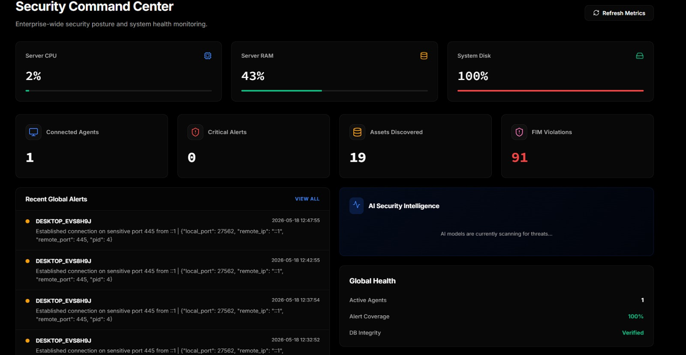
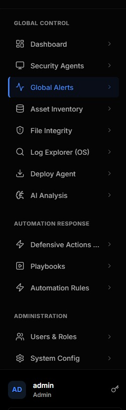
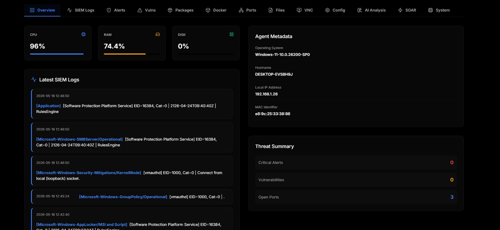
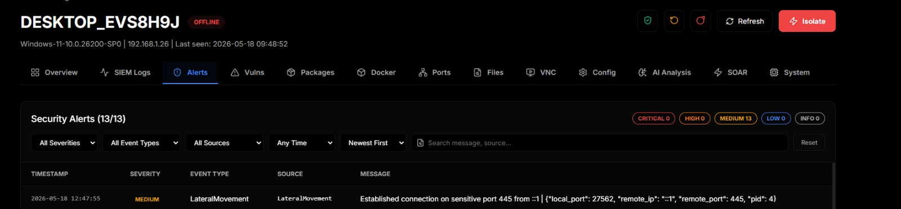
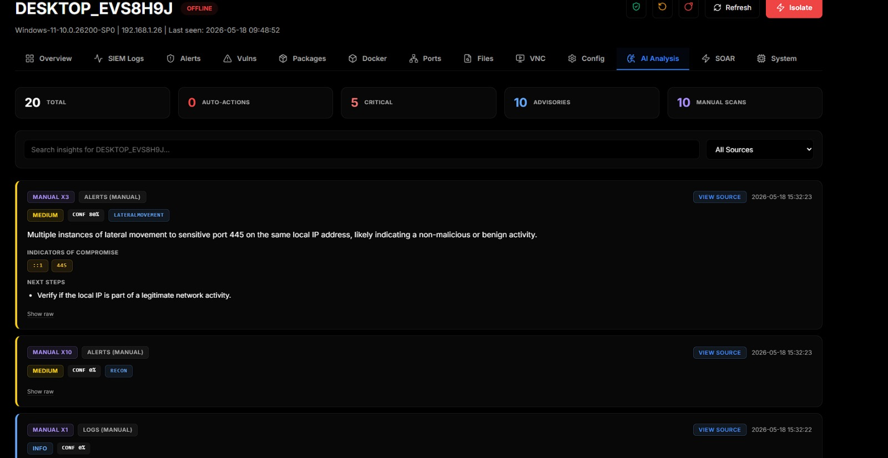
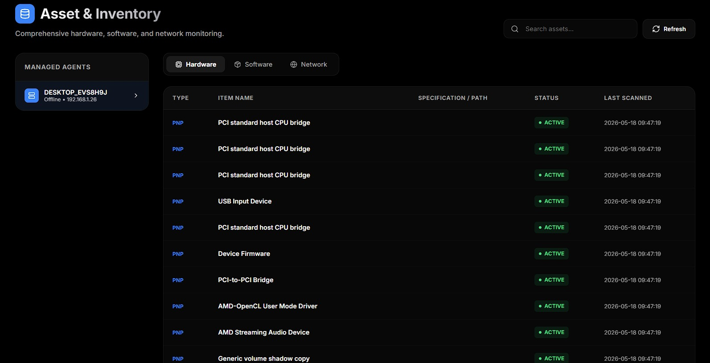
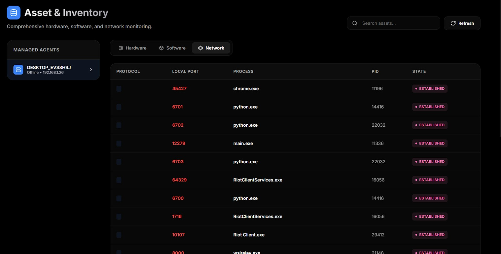
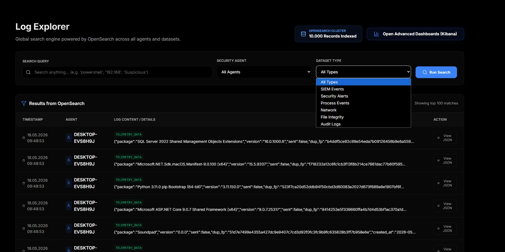
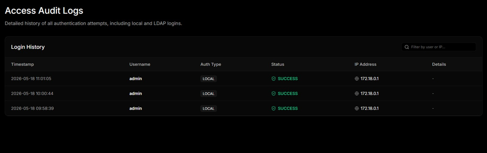

# Sentora Community Edition

[](https://www.gnu.org/licenses/agpl-3.0)
[](https://www.python.org/)
[](https://sanic.dev/)

Self-hosted security stack for small/mid teams that don't have a dedicated
SOC. Drop an agent on each endpoint, point them at the server, and you get
SIEM logs, file integrity, package vulnerabilities, an OpenSearch-powered
log explorer, autonomous AI triage and a SOAR playbook engine, all in one
`docker compose up`.

The "AI" part is a locally-running Ollama model (default `llama3.2:3b`).
Logs never leave the box; there's no OpenAI key, no Anthropic key, no
phone-home. If you want a smarter model and have the RAM, swap it in `.env`.



---

## What it actually does

- **Collects telemetry** from Windows and Linux agents over a single TCP
  channel. SIEM events, alerts, FIM, packages, network connections,
  open ports, Docker activity, screen frames.
- **Detects with Sigma rules, on the endpoint.** 15 rules covering 16 MITRE
  ATT&CK techniques ship in `conf/sigma/builtin/`; drop community rulesets in
  beside them. Sigma matches *named fields* rather than text, so
  `Image|endswith: '\vssadmin.exe'` cannot be defeated by the word "vssadmin"
  appearing in an unrelated message — and
  `CommandLine|utf16le|base64offset|contains` reads inside a base64
  `-EncodedCommand` payload, where the plaintext command line shows only the
  wrapper. Measured on the eval corpus: 9 of 10 attacks caught by Sigma alone,
  0 of 9 hard negatives falsely flagged. This layer is deterministic and keeps
  working when the model is unavailable.
- **Correlates across events**, which no per-event rule can do. A single
  failed logon is routine; five accounts failing from one source in forty
  seconds is a password spray, and looking at any one of those five events
  will never tell you that. Covers spray, brute force, a success arriving
  after repeated failures, bursts of account creation and service installs —
  on both platforms, from Windows event IDs or from parsed `auth.log` lines.
  Adds the three T1110 brute-force techniques no per-event rule can express,
  taking total coverage to 19. Fires once per window rather than once per
  event, and every counter is bounded, because a counter keyed on an
  attacker-supplied username is a memory exhaustion primitive rather than a
  detection.
- **Maps detections to MITRE ATT&CK, from the rules themselves.** Rules carry
  `tags: attack.t1490`, so there is no hand-kept mapping table to go stale. The
  coverage page separates three states a single "coverage %" would hide:
  covered and seen, covered and quiet, and *not covered at all* — the last
  being the only one where the console's silence means nothing.
- **Triages every event with a local LLM.** Three workers run in parallel:
  one watches every incoming event in real time, one runs operator-driven
  deep scans, and one decides whether to take a defensive action
  (`BLOCK_IP`, `ISOLATE_HOST`, `KILL_PROCESS`, etc.).
- **Shadow mode for the defensive worker.** Flip `AI_SHADOW_MODE=1` and
  every autonomous verdict is staged for human approval in the SOAR Hub
  instead of being dispatched. Useful for tuning the model on real
  traffic before letting it act on its own.
- **Indexes everything in OpenSearch** so you can grep your fleet with
  fuzzy / exact / starts-with queries from one place.
- **Runs SOAR playbooks** built in a small visual editor with multi-step,
  per-node result tracking, can be triggered manually or by AI verdict.
- **Vulnerability scans** every agent's installed packages against OSV
  (online or via an internal mirror).
- **Pulls threat-intel feeds** from abuse.ch (Feodo, ThreatFox, URLhaus)
  into a local indicator table, with staleness pruning and an air-gap
  switch.
- **Validates agent configs before pushing them.** YAML parse, structural
  shape and regex compilation — an invalid regex is valid YAML and silently
  disables the rule containing it.
- **Built-in remote desktop** via WebSocket JPEG streaming, no separate
  VNC install needed on the endpoint.

## What it looks like

The sidebar groups everything into three sections: telemetry (dashboard,
agents, alerts, assets, FIM, logs, AI), automation response
(defensive actions, playbooks, automation rules), and administration.

<p align="center">
  
</p>

### Per-agent view

Each enrolled agent has its own page with twelve tabs. The overview
shows live resource meters, the most recent SIEM logs, agent metadata
and a threat summary:



Alerts are everything the agent's own correlation rules already flagged.
Severity-coloured, filterable, searchable:



The AI Analysis tab is the operator-facing side of the local LLM. Manual
and automatic scans both land here. Each insight carries a verdict chip,
confidence, MITRE indicators (when the model returns them), IOCs, next
steps, and a *View Source* button that opens the exact log row the AI
looked at:



### Asset inventory

Hardware, software, and network sockets per agent. Hardware tab lists
every PnP device, software lists installed packages, network lists every
TCP/UDP socket with its owning process:





### Log Explorer

Cross-agent search backed by OpenSearch. Pick an agent, pick a dataset
(SIEM events, security alerts, process events, network, FIM, audit
logs), and search. There's also a button to open OpenSearch Dashboards
(Kibana fork) for power users:



### Audit logs

Every login attempt against the platform itself, both local and LDAP,
with result, source IP, and timestamp. Useful when someone is in the
"who-logged-in-when" mood:



---

## Quick start

You'll need Docker 24+ with Compose v2 and Python 3.10+ on the host (only
for the one-time agent build step). The full stack wants ~16 GB RAM,
see [System requirements](#system-requirements) below.

```bash
git clone https://github.com/d3vhex/Sentora.git
cd Sentora

# .env holds your local secrets. Never commit it.
cp .env.example .env

# Generate the machine-generated secrets (FERNET_KEY, RABBITMQ_PASSWORD,
# AGENT_SHARED_SECRET, OPENSEARCH_PASSWORD). Safe to re-run — it never
# overwrites a value that is already set.
python scripts/init_secrets.py

# Then set DB_PASSWORD by hand. Compose refuses to start without it.
# On an existing deployment, rotate it with scripts/rotate_db_password.py
# instead — MySQL fixes the root password at first init, so editing .env
# alone locks the app out rather than changing the account.

# Build the agent binary once. The server serves it via
# /api/agent/download/{linux,windows}; skipping this means agents can't be
# deployed because the download endpoint returns 404.
cd Sentora
./build_agent.sh                 # on Linux/macOS/WSL
# .\build_agent.ps1              # on Windows
cd ..

docker compose up --build -d
```

Open <http://localhost:8000>. Default login is `admin` / `admin123`.
Change it immediately under **Users & Roles**.

Ollama auto-pulls `llama3.2:3b` on first boot. Verify with:

```bash
docker exec sentora-ollama ollama list
```

Deploying an agent: from the **Deploy Agent** page, copy the one-liner
for the OS you want. On the target machine (admin shell), paste it. The
installer downloads the binary, drops a config, enrols with the server,
and registers itself as a scheduled task / systemd unit.

---

## Services in the compose

| Service | Port | Reachable from | Purpose |
| :--- | :--- | :--- | :--- |
| `app` | `:8000` | anywhere | REST API + React UI |
| `ingest` | `:5001` | anywhere | TCP log collector (the agent sends here) |
| `db` | `:3307` | localhost | MySQL 8.0 (3306 inside the network) |
| `rabbitmq` | `:5672` / `:15672` | localhost | Job queue + management UI |
| `ollama` | `:11434` | localhost | Local LLM runtime |
| `opensearch` | `:9200` | localhost | Full-text log search |
| `opensearch-dashboards` | `:5601` | localhost | Optional Kibana-style explorer |
| `ai-worker-{automation,manual,defensive}` |   | — | LLM analysis workers |

Only `app` and `ingest` listen on all interfaces. The rest bind to
`BIND_ADDR` (default `127.0.0.1`), because none of them authenticate in the
default configuration — OpenSearch runs with its security plugin disabled and
Dashboards is an unauthenticated view of every collected log. Expose one by
putting it behind the same reverse proxy and auth as `app`, not by widening
`BIND_ADDR`.

The "Open Dashboards" button in Log Explorer links to port 5601 on the
server's hostname, so it works from the host itself; remote operators need
that reverse proxy.

---

## System requirements

| Profile | CPU | RAM | Disk | Notes |
| :--- | :--- | :--- | :--- | :--- |
| Lab (≤ 5 agents) | 4 cores | 12 GB | 40 GB SSD | `llama3.2:3b`, OpenSearch heap at 1 GB |
| Small team (10–50 agents) | 8 cores | 16 GB | 100 GB SSD | Compose defaults are fine |
| Production (50+ agents) | 16+ cores | 32 GB+ | 250 GB+ NVMe | Move OpenSearch and Ollama onto their own hosts |

Idle footprint:

- Ollama (`llama3.2:3b`): ~3 GB, more under inference
- OpenSearch: ~2 GB default heap, disk grows with retention
- MySQL: 500 MB – 1 GB
- RabbitMQ: ~300 MB
- Sanic + ingest + 3 AI workers: ~1 GB combined

If you're tight on RAM, swap to `qwen2.5:1.5b` or another small Ollama
model and shrink the OpenSearch heap. A GPU isn't required but Ollama
will use it automatically if present.

---

## Defensive AI auto-actions

When the defensive worker's verdict is `ACT` with confidence ≥
`AI_AUTO_ACT_CONF` (default `0.75`) and the recommended action is on the
safe-list below, the worker queues the action straight into the agent's
`automations` table:

```
BLOCK_IP        KILL_PROCESS      RESTART_SERVICE   ISOLATE_HOST
DISABLE_USER    QUARANTINE_FILE   SUSPEND_PROCESS   LOGOFF_USER
CONTAINER_ISOLATE   CONTAINER_STOP   CONTAINER_KILL
```

Anything outside that list (arbitrary `RUN_CMD`, `DELETE_FILE`, etc.)
gets downgraded to an advisory insight. The operator has to dispatch
it manually from the SOAR Hub. Auto-dispatched actions show a red AUTO
chip in the UI.

To disable autonomy entirely, set `AI_AUTO_ACT_CONF=1.0` in `.env`. To
disable the periodic defensive sweep, set `AI_DEFENSIVE_SWEEP_ENABLED=0`.

### Shadow mode

Set `AI_SHADOW_MODE=1` in `.env` and the defensive worker stops firing
real actions. Verdicts that would have triggered an autonomous response
are saved as **proposals** instead, with `source_file = AI_DEFENSIVE_SHADOW`
and `shadow_status = pending`. The operator reviews each one from
**SOAR Hub > Shadow Queue** and either:

- **Approve** > the real SOAR action (`call_agent_soar`) fires and the
  proposal is marked `approved` (with timestamp + operator name).
- **Reject** > the proposal is marked `rejected` with an optional note.
  No action is taken.

Proposals never expire; nothing decides for you. Useful for letting the
model run on production telemetry while you build confidence in its
verdicts before unleashing real `BLOCK_IP` / `ISOLATE_HOST` etc.

---

## Security notes

### Authentication

The UI authenticates with a server-side session: login issues an opaque token
in an `HttpOnly` cookie, and `userdb.sessions` is the authority. Only the
SHA-256 of the token is stored, so a database dump yields nothing presentable.

Two clocks apply, both configurable in `.env`:

| Setting | Default | Meaning |
| :--- | :--- | :--- |
| `SESSION_IDLE_MINUTES` | `60` | Session dies this long after its last request |
| `SESSION_ABSOLUTE_HOURS` | `12` | Hard ceiling regardless of activity |
| `SESSION_COOKIE_SECURE` | `0` | Set to `1` once TLS terminates in front of the app |
| `SESSION_COOKIE_SAMESITE` | `Lax` | `Lax` blocks the cross-site POST/XHR that CSRF needs |

Sessions are revoked immediately on password change, admin password reset,
role change and account deletion — an admin removing someone's access no
longer leaves their open tab working.

Every route is **deny-by-default**: without a valid session a request is
rejected before the handler runs. The exceptions are the login endpoint, the
SPA shell, static assets, and the agent-facing endpoints, which authenticate
with `X-Agent-Key` or an enrollment token instead.

`X-User-ID` is still sent by the frontend, but it is no longer identity — the
server validates it against the session and rejects a mismatch. Because
browsers cannot attach custom headers to cross-site requests without a CORS
preflight, requiring it on state-changing requests backs up `SameSite` as a
second CSRF control.

Route protection is declared with `@require_permission(...)` and enforced by
middleware through a registry, so it applies regardless of which side of
`@app.route` the decorator sits on. The boot log prints the tally:

```
[Auth] Routes: <n> permission-gated, <n> session-only, <n> public.
```

If that line reports `0 permission-gated`, RBAC is not being enforced — treat
it as an outage.

Every route must be one of three things: permission-gated, listed in
`_PUBLIC_HANDLERS`, or named in `SESSION_ONLY_HANDLERS` in
`tests/test_auth_wiring.py` with a comment saying why session alone is
enough. A test asserts it, so a new route cannot quietly arrive ungoverned —
which is how `run_playbook`, `delete_soar_action` and `test_ldap_connection`
had ended up reachable by any account that could log in.

### Login throttling

Five failed attempts for one account, or twenty from one address, inside
fifteen minutes, and further attempts are refused with `429` until the window
passes. Counted from `login_logs`, which was already recording every failure
and which nothing read — bcrypt was the only brake on online guessing.

| Setting | Default | Meaning |
| :--- | :--- | :--- |
| `LOGIN_MAX_FAILURES_USER` | `5` | Per-account failures allowed in the window |
| `LOGIN_MAX_FAILURES_IP` | `20` | Per-address failures; higher, because an office shares one NAT address |
| `LOGIN_LOCKOUT_WINDOW_MIN` | `15` | How far back failures are counted |

The check runs before the password comparison, so it also removes the timing
difference between a known and an unknown username. It fails open if
`login_logs` is unreachable: a login page that cannot be reached because the
audit table is down is its own outage.

### Client addresses behind a proxy

`X-Forwarded-For` is honoured only from a peer listed in `TRUSTED_PROXIES`
(comma-separated addresses or CIDRs, empty by default). With nothing in front
of the app the header is attacker-supplied, so believing it unconditionally —
which is what this replaced — let a caller write any address into the audit
trail and reset their own rate limit in the same request.

```
TRUSTED_PROXIES=10.0.0.0/8,192.168.1.5
```

Leave it empty when the app is reached directly.

### The agent's own API

The agent listens on `0.0.0.0:9099` and runs as SYSTEM or root. Every route
requires `X-Agent-Key`; `/self_destruct` requires this agent's own enrolment
key specifically, so a leaked fleet-wide secret cannot uninstall every
endpoint at once. `/health` answers liveness without a key and discloses
nothing further without one.

There is no permissive fallback. An earlier build accepted any non-empty key
whenever `AGENT_MASTER_SECRET` was unset on the host — which nothing ever set,
so it was the default everywhere. An EDR that fails open is worse than no EDR,
because the console reports the endpoint as protected.

`AGENT_BIND` moves the listener. It is still `0.0.0.0` by default because the
server reaches agents over HTTP on this port; binding to loopback needs a
replacement transport, not a config change.

### CORS

`CORS_ORIGINS` defaults to empty. In the normal deployment this app serves the
SPA itself, so requests are same-origin and no entry is needed. A wildcard is
rejected outright: browsers refuse `Access-Control-Allow-Origin: *` on any
request carrying cookies. Split-origin deployments must list explicit origins
and set `SESSION_COOKIE_SAMESITE=None` with `SESSION_COOKIE_SECURE=1`.

### Default secrets

`.env.example` ships with placeholders. The real `.env` is git-ignored.
Rotate these before exposing the platform to anything beyond `localhost`:

- `DB_PASSWORD`
- `AGENT_SHARED_SECRET` (agent auth fallback). Auto-generated on first
  boot if unset.

The `admin / admin123` login no longer needs remembering: the seeded account
is created with `must_change_password`, and while that is set the session can
reach nothing but `/change-password`. Enforced in middleware rather than in
the UI, because a flag the front end is trusted to honour is a suggestion and
the API answers curl too.

### TLS certificates

Nothing ships a private key. A working `certs/server.key` and
`certs/rootCA.key` used to be committed, which gave every deployment the same
TLS identity and published it: anyone who had ever cloned the repository held
the key, so the certificate proved nothing about who was on the other end.

With `TLS_ENABLED=1` and no certificate present, the app generates one on
first boot. Each install gets its own key and the key never leaves the machine
that made it. `certs/*.key` and `certs/*.crt` are git-ignored.

The CA is self-signed, so browsers warn unless you trust it explicitly. That
warning is honest — prefer it to a shared secret that produces no warning at
all. For anything public, point `TLS_CERT` / `TLS_KEY` at a real certificate;
when they are set and missing, the app says so rather than substituting a
self-signed one.

To regenerate by hand:

```bash
python certs/generate_certs.py --force
```

**The old keys are still in git history.** Treat the pair that shipped before
this change as burned; new installs no longer use it.

### Local Fernet keys

The server uses two Fernet keys, both auto-generated on first boot:

| Key | Location | Protects |
| :--- | :--- | :--- |
| Agent key | `data/fernet.key` (or `FERNET_KEY_PATH`) | Agent telemetry; handed out via `/api/agents/bootstrap` |
| Server key | `.env` `FERNET_KEY` | Server-internal at-rest fields (e.g. password column) |

`chmod 600` both. Back them up. Losing either makes the corresponding
encrypted data unreadable. There is no in-place rotation yet.

### Threat intel

Two independent mechanisms, both optional:

**Per-verdict enrichment** (`ai/intel.py`). The AI worker cross-checks
indicators found in a log against AlienVault OTX and VirusTotal. Needs
`OTX_API_KEY` / `VT_API_KEY`; unset means no external call at all.

**Indicator feeds** (`core/threat_feeds.py`). Populates the `threat_intel`
table hourly from abuse.ch — Feodo Tracker (botnet C2 addresses), ThreatFox
(mixed IoCs with a confidence score) and URLhaus (malware-distributing URLs).

Indicators carry `last_seen` and are pruned after `THREAT_INTEL_STALE_DAYS`
(default 30): an address that hosted a C2 last quarter usually belongs to
someone else now, and keeping it produces false positives indefinitely. Each
feed is capped at `THREAT_INTEL_MAX_PER_FEED` rows because the table is read
on the alert path.

abuse.ch has been moving downloads behind a free account key. A feed
returning 401/403 says so in the server log; set `THREAT_INTEL_AUTH_KEY`.

Check what actually arrived:

```bash
docker logs sentora-server | grep ThreatIntel
```

### Air-gap mode

```ini
OSV_MODE=mirror
OSV_MIRROR_URL=http://osv.internal

THREAT_INTEL_MODE=off
# or serve the feeds internally:
# THREAT_INTEL_FEODO_URL=http://mirror.internal/feodo.json
```

With those set, plus `OTX_API_KEY` / `VT_API_KEY` unset, nothing leaves the
network. Fonts are bundled, Ollama is local, no CDN is contacted.

### Fleet exposure

`/api/exposure/report` counts unpatched packages and file-integrity events
across the fleet, per agent, worst first. It reports its own coverage:
`complete: false` when an agent could not be read, because a total over half
the fleet is not a fleet total.

There is deliberately no score. The endpoint previously returned
`100 - vulns*2 - fim*5` as a "compliance score" — that maps to no framework,
does not scale with fleet size, and pins to zero on any real fleet. Severity
grading is absent for the same reason: `vulnerabilities_report` has no
severity column and its fields are encrypted at rest, so any grade would have
to be invented.

### Agent config validation

`POST /<agent>/config/<type>` validates before anything reaches a sensor:
YAML parse, structural shape, and — the layer that matters — **regex
compilation**. An invalid regex is perfectly valid YAML and silently disables
the category containing it, so a syntax-only check would push it straight to
the endpoint. The editor lints against the same endpoint as you type and
reports issues with clickable line numbers.

---

## Architecture overview

```
 Agent (Win / Linux)
    │  TCP frames + REST polling
    ▼
 ingest (:5001) ──► RabbitMQ ──► AI worker fleet (3 modes)
    │                                  │
    ▼                                  ▼
 MySQL (per-agent <name>_db)    ai_analysis_results
    │
    ▼
 app (Sanic :8000)  ──► React UI + REST + WebSocket screen proxy
```

The deeper version (per-module layout, schema, AI pipeline, SOAR
autonomy, air-gap surfaces) lives in
[docs/Sentora_Architecture.md](docs/Sentora_Architecture.md).

Operational docs:

| Document | Covers |
| :--- | :--- |
| [Architecture](docs/Sentora_Architecture.md) | Module layout, data flow, auth model, AI pipeline |
| [Production deployment](docs/production-deployment.md) | Sizing, network topology, TLS, backup, monitoring, air-gap |
| [Update runbook](docs/update-runbook.md) | Upgrades, agent rollout, DB migrations, rollback |
| [Progress report](docs/PROGRESS_REPORT.md) | What has changed and why |

---

## Development setup

```bash
# 1. Database. Only init_userdb.sql — it creates and selects `userdb`.
#
#    db/init.sql is NOT a server-init script. It is the per-agent schema
#    template, applied by server.create_tables_if_not_exist() after
#    connecting to that agent's own database, which is why it contains no
#    CREATE DATABASE or USE. Running it standalone fails at line 5 with
#    "No database selected" — the same way it broke every first-time
#    `docker compose up` while it was mounted into the MySQL init directory.
mysql -u root -p < db/init_userdb.sql

# 2. Backend. requirements.lock pins every version the image is built
#    from; requirements.txt is the loose list it was resolved from.
pip install -r requirements.lock
python app.py

# 3. Ingest (separate terminal)
python server.py

# 4. Frontend dev server
cd frontend
npm install
npm run dev
```

### AI workers manually

Same script, three roles:

```bash
WORKER_TYPE=automation python ai_worker.py
WORKER_TYPE=manual     python ai_worker.py
WORKER_TYPE=defensive  python ai_worker.py
```

Production: let `docker-compose.yaml` do it.

---

## Contributing

PRs welcome. Before opening:

1. Fork → branch → PR against `main`.
2. Run the checks:

```bash
pytest -ra                                   # no MySQL or RabbitMQ needed
python -m compileall -q app.py core security
cd frontend && npx tsc --noEmit && npm run build && cd ..

# With the stack up — enumerates every route and calls it twice
python scripts/api_smoke_test.py
```

3. New endpoints must be wrapped in `@require_permission(...)`. The boot log
   prints the tally; if it reports `0 permission-gated`, something is wrong
   with the wiring, not with your route.
4. Anything that reaches an agent or an external host needs validation on the
   server side, not only in the browser. Two implementations drift, and the
   browser's copy is the one operators end up trusting.

For anything bigger than a fix, open an issue first so we can align on
the approach.

---

## Project layout

```
.
├── app.py                     # Sanic API + React SPA host
├── server.py                  # TCP ingest
├── ai_worker.py               # AI worker fleet (3 modes)
├── ai/
│   ├── utils.py               # LLM helpers, AI cache, SOAR queueing
│   └── intel.py               # OTX / VT per-verdict enrichment (opt-in)
├── core/
│   ├── mq.py                  # RabbitMQ publisher
│   ├── opensearch.py          # OpenSearch index/search
│   ├── config_validation.py   # Agent YAML validation (parse, shape, regex)
│   └── threat_feeds.py        # abuse.ch indicator feeds
├── security/
│   ├── session.py             # Server-side session store
│   └── ssrf.py                # Proxy destination rules
├── scanners/
│   └── vuln.py                # Server-side OSV scanner
├── scripts/
│   ├── init_secrets.py        # Generate the secrets .env needs
│   ├── rotate_db_password.py  # Rotate the MySQL root password safely
│   └── api_smoke_test.py      # Exercise every route against a live server
├── tests/                     # pytest; no MySQL or RabbitMQ required
├── frontend/                  # React 18 + TS SPA
│   └── src/lib/               # Shared logic (playbook action catalogue)
├── Sentora/                   # Cross-platform agent
├── certs/                     # Self-signed dev certs
├── docs/                      # Architecture + screenshots
└── docker-compose.yaml
```

---

## License

AGPL-3.0. See [LICENSE](LICENSE).

Use, modify, redistribute. The thing AGPL adds on top of regular GPL:
if you run a modified version on a network server where other users
interact with it, you must publish the modifications under AGPL too.

- Self-hosting for internal use → no source-disclosure obligation.
- Public-facing SaaS on top of a modified Sentora → you must publish
  the modifications.
- Want to ship a closed-source derivative or skip the network-copyleft
  clause? A commercial licence waiver is available. Contact the author.

The "Sentora" name and logo are trademarks of the project authors and
are not covered by AGPL. Fork freely, but rename if you redistribute as
your own product.

---

## What's not in Community Edition

Community Edition has zero artificial caps: no agent limit, no
retention limit, no feature gating on the core. Run it as wide as your
hardware allows.

The paid Pro / Enterprise distribution adds enterprise-glue features
(SAML/SCIM SSO, multi-tenancy, compliance reports, HA, WORM audit,
signed air-gap update bundles, 4-eyes SOAR approvals, premium
ticketing/SIEM forwarders). The core detection capability never gets
moved behind that wall.

If any of that matters for your deployment,
[reach out](mailto:oguzhanbayarslan@gmail.com).
